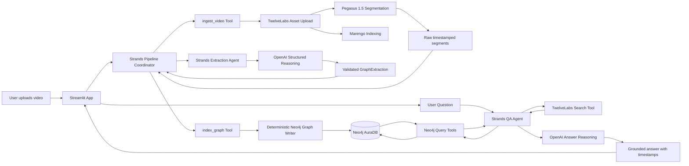

# Video Agent Context Graph - Complete Implementation Plan

This document preserves the original target design and delivery sequence. Section 1.1
and the task board in Section 24 record the current implementation; unchecked items and
later phases remain roadmap work.

## 1. Project Summary

### Working title

**Video Context Graph Agent**

### Hackathon theme

Build a video agent that ingests raw video, understands what is shown, said, heard, and written on screen, converts that understanding into a context graph, and answers questions by reasoning over the connected information.

### Core sponsor stack

- **TwelveLabs**: video upload, multimodal segmentation, analysis, and semantic moment search.
- **Neo4j AuraDB**: persistent graph storage and Cypher-based retrieval.
- **OpenAI**: structured normalization, entity resolution, reasoning, and grounded answer generation.
- **Strands Agents**: agent orchestration, custom tool calling, structured outputs, and the question-answering workflow.

### Team and development constraints

- Team size: 3 developers.
- Coding assistant: Codex.
- Git model: one shared branch.
- Goal: hackathon-quality, reliable demo; not production infrastructure.
- The app must accept different video domains without code changes.
- The team will decide the final demo video only after testing several types.

---

## 1.1 Current implementation status — 2026-07-30

- The fixture, live-OpenAI hybrid, and full-live Streamlit modes are implemented.
- `TwelveLabsClient`, `Neo4jGraphService`, Strands/OpenAI extraction and QA, and the
  code-defined pipeline coordinator are integrated.
- A full-live browser run processed the 52-second W3C Sintel trailer: 6 scenes,
  6 entities, 7 events, 38 Neo4j nodes, 68 relationships, eight saved semantic-search
  results, and a grounded chronological answer with six timestamp citations.
- The pipeline trace visibly records the coordinator and sponsor handoffs. The current UI
  does not show the QA agent's internal tool-call trace.
- Live direct-URL ingestion is verified. Streamlit browser-upload persistence is not yet
  connected.
- QA remains scoped to one selected video. Multi-day surveillance search remains a
  stretch goal described in `docs/surveillance_demo.md`.

---

## 2. Architecture Decision

### Selected architecture

Use a **Python 3.11 Streamlit application** with a modular service layer.

The application will use:

- Streamlit for the user interface.
- TwelveLabs Python SDK for video ingestion, segmentation, and search.
- Strands Agents Python SDK with the OpenAI Responses provider.
- Pydantic models for strict data contracts.
- Neo4j official Python driver for parameterized Cypher queries.
- PyVis and NetworkX for graph-visualization payload support; the current Streamlit graph
  explorer renders validated tables, while interactive PyVis embedding remains pending.
- Pytest for unit and integration tests.
- Local JSON artifacts for caching and debugging.

### Why this architecture

1. It minimizes front-end work during a hackathon.
2. All sponsor tools have strong Python support.
3. Streamlit allows the team to demonstrate upload, progress, graph exploration, and chat in one app.
4. A modular service layer lets three people work in separate directories.
5. Pydantic contracts reduce integration errors between independently developed modules.
6. A domain-neutral graph schema supports meetings, cooking, sports, movies, surveillance-style scenes, lectures, retail, and other videos.
7. Cached intermediate artifacts allow prompt and graph changes without repeatedly paying to process the same video.

### Explicit non-goals

Do not spend hackathon time on:

- User authentication or accounts.
- Multi-tenant data isolation.
- Distributed queues or worker services.
- Kubernetes, cloud deployment, or autoscaling.
- Real-time video streaming analysis.
- Face recognition or biometric identity matching.
- Production-grade authorization for arbitrary Cypher.
- Perfect cross-video identity resolution.
- Mobile applications.
- Full video editing or automatic clip generation.

---

## 3. High-Level System Design



### Important design principle

Use AI for interpretation and reasoning, but use deterministic code for infrastructure operations.

- Uploading files, polling task status, validating output, and writing graph records should be deterministic Python.
- OpenAI should normalize extracted information, resolve aliases, choose relevant tools, and create final answers.
- Neo4j writes should use fixed, parameterized Cypher templates.
- The QA agent should use safe read tools rather than unrestricted generated Cypher in the MVP.
- Strands should visibly coordinate the sponsor stages through named tool boundaries.
- The UI should show sponsor handoffs, stage status, duration, and compact result summaries
  without exposing chain-of-thought.

---

## 4. Sponsor Tool Responsibilities

## 4.1 TwelveLabs

### Planned use

1. Upload the video as a reusable asset.
2. Use Pegasus 1.5 time-based segmentation to obtain timestamped scenes and metadata.
3. Index the asset in a Marengo index for semantic search.
4. Search for relevant moments when the user asks a question.

### Why both segmentation and search are needed

- Segmentation creates the initial structured material used to build the graph.
- Search finds semantically relevant moments for questions that cannot be resolved by graph structure alone.
- The graph gives relationships and memory; TwelveLabs gives direct grounding in the source video.

### TwelveLabs segment definition

Use one general `scenes` segment type for the MVP. It should not assume a particular domain.

Suggested fields:

| Field | Type | Purpose |
|---|---|---|
| `summary` | string | Concise description of the scene |
| `location` | string | Visible or inferred setting |
| `participants` | array of strings | People, teams, speakers, or characters |
| `objects` | array of strings | Important visible objects, products, tools, or props |
| `actions` | array of strings | Major actions or events |
| `speech_summary` | string | Meaning of spoken content |
| `on_screen_text` | array of strings | Signs, slides, labels, captions, or written text |
| `topics` | array of strings | Concepts or discussion topics |
| `tags` | array of strings | General searchable labels |
| `sentiment` | enum | positive, negative, neutral, mixed, unknown |

Segment description:

> Segment the video into distinct scenes based on meaningful changes in location, participants, activity, topic, or visual composition. Extract only information supported by the video. Preserve precise start and end timestamps.

### Optional domain hint

The upload form can include an optional domain profile:

- Auto
- Meeting
- Cooking
- Sports
- Story or movie
- Surveillance-style activity
- Lecture or tutorial
- Retail or product demo

The domain profile only adds extraction priorities to the prompt. It must not change the graph schema.

Examples:

- Meeting: emphasize speakers, decisions, tasks, dates, and topics.
- Cooking: emphasize ingredients, tools, actions, and sequence.
- Sports: emphasize players, teams, actions, scores, and possessions.
- Story or movie: emphasize characters, locations, props, dialogue, and plot events.

### TwelveLabs workflow

1. Validate local file extension and size.
2. Create an asset with direct upload.
3. Poll the asset until `ready` or `failed`.
4. Start a Pegasus 1.5 asynchronous segmentation task.
5. Poll segmentation until `ready` or `failed`.
6. Save the raw segmentation response locally.
7. Index the same asset in the configured Marengo index.
8. Poll the indexed asset until ready.
9. Store all TwelveLabs identifiers on the Neo4j `Video` node and in the local job record.

### Limits for the hackathon app

- Default maximum upload size: 200 MB.
- Default recommended test duration: 1 to 10 minutes.
- Configurable hard duration target: 15 minutes for the MVP.
- Public URLs should be direct raw media URLs, not video-platform page URLs.

---

## 4.2 OpenAI

### Planned use

OpenAI is used through Strands Agents for two main tasks.

#### A. Graph normalization

Convert the TwelveLabs timestamped segment output into a strict, domain-neutral `GraphExtraction` object.

Responsibilities:

- Canonicalize repeated entity names within a video.
- Resolve simple aliases such as `the chef`, `speaker 1`, and an explicit name when evidence supports it.
- Assign stable local identifiers.
- Convert scene descriptions into entities, events, tags, and relationships.
- Preserve TwelveLabs timestamps exactly.
- Avoid inventing names or relationships.
- Add confidence values and evidence descriptions.

#### B. Question answering

- Interpret the user's natural-language question.
- Choose the correct TwelveLabs and Neo4j tools.
- Combine semantic video moments with graph relationships.
- Produce a concise answer with scene and timestamp evidence.
- State uncertainty when the evidence is incomplete.

### Model configuration

Use environment variables rather than hardcoding a model throughout the code.

Recommended hackathon default:

```text
OPENAI_MODEL=gpt-5.6-terra
OPENAI_REASONING_EFFORT=low
```

Rationale:

- Terra is intended to balance capability and cost.
- Low reasoning effort should be sufficient for normal extraction and graph questions.
- The team can switch to `gpt-5.6` for difficult final-demo questions without code changes.

### Structured output requirements

Use Pydantic schemas and Strands structured output for:

- `GraphExtraction`
- `AnswerResult`
- Optional `QueryIntent`

Never parse a large free-form model response using regular expressions.

---

## 4.3 Strands Agents

### Planned use

Use Strands as the application-level agent framework and orchestration layer.

Create two specialized agents:

1. **Extraction Agent**
   - Input: TwelveLabs segments plus video metadata.
   - Output: validated `GraphExtraction`.
   - No database write permissions.

2. **Question Answering Agent**
   - Input: selected video and user question.
   - Tools: semantic video search and safe Neo4j read tools.
   - Output: validated `AnswerResult`.

### Strands custom tools

Implement tools with the `@tool` decorator or class-based tools when shared clients are required.

QA tools:

- `search_video_moments`
- `list_video_entities`
- `get_entity_timeline`
- `get_scene_details`
- `get_events_before_or_after`
- `find_entity_connections`
- `get_video_overview`

Required pipeline tools for sponsor-visible orchestration:

- `ingest_video`
- `index_graph`
- `get_ingestion_status`
- `get_graph_statistics`

`ingest_video` wraps deterministic TwelveLabs upload, polling, segmentation, and indexing.
`index_graph` accepts only a validated `GraphExtraction` and wraps deterministic,
parameterized Neo4j writes. These tools make sponsor handoffs visible without giving the
model unrestricted infrastructure authority.

### Orchestration choice

For the MVP, use a code-defined Strands coordinator instead of a highly autonomous
multi-agent swarm. The coordinator calls named stage tools and the Extraction Agent in a
fixed order.

Pipeline:

```text
Strands Pipeline Coordinator
    -> ingest_video tool
         -> deterministic TwelveLabs upload, segmentation, and indexing
    -> Strands Extraction Agent
         -> OpenAI structured GraphExtraction
    -> deterministic validation
    -> index_graph tool
         -> deterministic Neo4j write
    -> Strands QA Agent
         -> TwelveLabs semantic search and safe Neo4j reads
```

The order and infrastructure behavior remain code-defined. This is more reliable than
allowing an agent to decide whether a file should be uploaded or whether a database
transaction should be committed, while still making Strands orchestration explicit to
users and judges.

### Demonstrating Strands to judges

The demo should visibly show:

- The Strands Pipeline Coordinator starting and completing each stage.
- The handoff to the TwelveLabs ingestion tool.
- The handoff from timestamped TwelveLabs evidence to the Extraction Agent.
- The Strands extraction step.
- The validated `GraphExtraction` handoff to the Neo4j indexing tool.
- The registered custom tools.
- A QA trace listing which tool was used.
- The final answer grounded in tool output.

Do not expose internal chain-of-thought. Display only a safe execution trace such as:

```text
1. Searched video for "red bag handoff"
2. Retrieved Scenes 4 and 5 from Neo4j
3. Checked events before Scene 5
4. Generated answer with two timestamp references
```

The ingestion trace should use the same safe format:

```text
1. Strands coordinator started TwelveLabs ingestion
2. TwelveLabs returned 8 timestamped scenes
3. Extraction Agent produced a validated GraphExtraction
4. Neo4j indexing tool wrote 42 nodes and 67 relationships
```

---

## 4.4 Neo4j AuraDB

### Planned use

Neo4j is the persistent context graph and query engine.

The application will:

- Create nodes and relationships from the normalized extraction.
- Use uniqueness constraints to make writes idempotent.
- Use parameterized Cypher queries.
- Query timelines, co-occurrence, event sequences, and entity connections.
- Display a limited graph visualization in Streamlit.

### Neo4j query policy

MVP:

- Only predefined, parameterized read queries are exposed to the QA agent.
- The model never receives database credentials.
- The model never writes raw Cypher directly to the database.

Stretch goal:

- Add a validated read-only Cypher tool.
- Reject queries containing write or administrative keywords.
- Enforce a row limit.
- Log the generated query.

---

## 5. Domain-Neutral Graph Model

The graph must work across multiple video types. Do not create a cooking-only, meeting-only, or surveillance-only schema.

## 5.1 Node types

### Video

Properties:

- `video_id`: deterministic application ID.
- `title`
- `file_name`
- `source_type`: `upload` or `url`.
- `domain_hint`
- `duration_sec`
- `status`
- `summary`
- `created_at`
- `twelvelabs_asset_id`
- `twelvelabs_index_id`
- `twelvelabs_indexed_asset_id`
- `segmentation_task_id`
- `pipeline_version`

### Scene

Properties:

- `scene_id`
- `video_id`
- `ordinal`
- `start_sec`
- `end_sec`
- `summary`
- `location`
- `speech_summary`
- `on_screen_text`
- `sentiment`
- `confidence`

### Entity

Use one general node label and an `entity_type` property.

Properties:

- `entity_id`
- `video_id`
- `canonical_name`
- `normalized_name`
- `entity_type`
- `aliases`
- `description`
- `confidence`

Recommended `entity_type` values:

- PERSON
- CHARACTER
- TEAM
- ORGANIZATION
- LOCATION
- OBJECT
- PRODUCT
- INGREDIENT
- TOOL
- VEHICLE
- DOCUMENT
- CONCEPT
- TOPIC
- UNKNOWN

### Event

Properties:

- `event_id`
- `video_id`
- `event_type`
- `description`
- `start_sec`
- `end_sec`
- `confidence`

Examples of `event_type`:

- ENTERS
- EXITS
- SPEAKS
- DISCUSSES
- PICKS_UP
- PLACES
- HANDS_OVER
- USES
- PASSES
- SCORES
- MIXES
- CUTS
- DECIDES
- ASSIGNS
- EXPLAINS
- CHANGES_LOCATION
- OTHER

### Tag

Properties:

- `tag_id`
- `name`
- `normalized_name`
- `category`

## 5.2 Relationship types

Use a small fixed relationship vocabulary.

- `(Video)-[:HAS_SCENE]->(Scene)`
- `(Scene)-[:NEXT_SCENE]->(Scene)`
- `(Scene)-[:HAS_EVENT]->(Event)`
- `(Entity)-[:APPEARS_IN]->(Scene)`
- `(Entity)-[:PARTICIPATES_IN {role}]->(Event)`
- `(Entity)-[:INVOLVED_IN {role}]->(Event)`
- `(Scene)-[:HAS_TAG]->(Tag)`
- `(Entity)-[:RELATED_TO {kind, description, confidence}]->(Entity)`
- `(Entity)-[:SAME_AS {confidence}]->(Entity)` as an optional future relationship

### Why relation meaning is sometimes a property

A fixed `RELATED_TO` relationship with a `kind` property supports domain-specific relationships such as:

- CARRIES
- LOCATED_NEAR
- PASSES_TO
- TALKS_TO
- USES_TOOL
- ASSIGNED_TO
- EXPLAINS_CONCEPT

This avoids schema changes every time a new video domain is tested.

## 5.3 Identity scope

For the MVP, entity identity is scoped to one video.

Do not merge `person 1` from one video with `person 1` from another video.

Deterministic entity identity input:

```text
video_id + entity_type + normalized canonical name
```

Cross-video entity linking is a stretch goal and should create `SAME_AS` relationships rather than immediately merging nodes.

## 5.4 Neo4j constraints and indexes

Create at startup through an idempotent script:

```cypher
CREATE CONSTRAINT video_id_unique IF NOT EXISTS
FOR (v:Video) REQUIRE v.video_id IS UNIQUE;

CREATE CONSTRAINT scene_id_unique IF NOT EXISTS
FOR (s:Scene) REQUIRE s.scene_id IS UNIQUE;

CREATE CONSTRAINT entity_id_unique IF NOT EXISTS
FOR (e:Entity) REQUIRE e.entity_id IS UNIQUE;

CREATE CONSTRAINT event_id_unique IF NOT EXISTS
FOR (e:Event) REQUIRE e.event_id IS UNIQUE;

CREATE CONSTRAINT tag_id_unique IF NOT EXISTS
FOR (t:Tag) REQUIRE t.tag_id IS UNIQUE;

CREATE INDEX entity_lookup IF NOT EXISTS
FOR (e:Entity) ON (e.video_id, e.normalized_name, e.entity_type);

CREATE INDEX scene_time_lookup IF NOT EXISTS
FOR (s:Scene) ON (s.video_id, s.start_sec);

CREATE INDEX event_time_lookup IF NOT EXISTS
FOR (e:Event) ON (e.video_id, e.start_sec);
```

Use uniqueness constraints only for the MVP because they are broadly compatible. Do not depend on Enterprise-only property existence constraints.

---

## 6. Core Data Contracts

Create these Pydantic models before parallel development starts. One teammate owns changes to this file.

## 6.1 Extraction contracts

```python
from pydantic import BaseModel, Field


class EntityExtraction(BaseModel):
    local_id: str
    canonical_name: str
    entity_type: str
    aliases: list[str] = Field(default_factory=list)
    description: str = ""
    confidence: float


class SceneExtraction(BaseModel):
    local_id: str
    ordinal: int
    start_sec: float
    end_sec: float
    summary: str
    location: str | None = None
    speech_summary: str | None = None
    on_screen_text: list[str] = Field(default_factory=list)
    sentiment: str = "unknown"
    entity_ids: list[str] = Field(default_factory=list)
    tags: list[str] = Field(default_factory=list)
    confidence: float


class EventParticipant(BaseModel):
    entity_id: str
    role: str


class EventExtraction(BaseModel):
    local_id: str
    scene_id: str
    event_type: str
    description: str
    start_sec: float
    end_sec: float
    participants: list[EventParticipant] = Field(default_factory=list)
    involved_entities: list[EventParticipant] = Field(default_factory=list)
    confidence: float


class EntityRelationshipExtraction(BaseModel):
    source_entity_id: str
    target_entity_id: str
    kind: str
    description: str
    scene_id: str | None = None
    confidence: float


class GraphExtraction(BaseModel):
    video_summary: str
    entities: list[EntityExtraction]
    scenes: list[SceneExtraction]
    events: list[EventExtraction]
    relationships: list[EntityRelationshipExtraction]
```

## 6.2 Answer contracts

```python
class EvidenceReference(BaseModel):
    scene_id: str
    start_sec: float
    end_sec: float
    reason: str


class AnswerResult(BaseModel):
    answer: str
    evidence: list[EvidenceReference]
    confidence: float
    limitations: list[str] = Field(default_factory=list)
```

## 6.3 Pipeline job contract

```python
from datetime import datetime


class PipelineJob(BaseModel):
    run_id: str
    video_id: str
    status: str
    current_stage: str
    stages: dict[str, str]
    artifact_paths: dict[str, str]
    external_ids: dict[str, str]
    error: str | None = None
    created_at: datetime
    updated_at: datetime
```

## 6.4 Contract rules

- Start and end timestamps must satisfy `0 <= start_sec < end_sec`.
- Scene ordinals must be unique and sorted.
- Every referenced scene and entity ID must exist.
- Confidence must be between 0 and 1.
- Empty or generic entities such as `something` should be discarded.
- Unnamed people should receive stable labels such as `person_1`, not invented names.
- The OpenAI normalizer may combine aliases only when the evidence is strong.

---

## 7. Processing Pipeline

## 7.1 Job state machine

```text
NEW
  -> VALIDATING
  -> UPLOADING_ASSET
  -> ASSET_PROCESSING
  -> ASSET_READY
  -> SEGMENTING
  -> SEGMENTS_READY
  -> INDEXING
  -> INDEX_READY
  -> NORMALIZING
  -> GRAPH_WRITING
  -> READY

Any stage -> FAILED
```

The app should display the current stage and retain failure details.

## 7.2 Idempotency

Generate `video_id` from a SHA-256 hash of the video bytes plus a pipeline version.

Example:

```text
video_id = sha256(file_bytes).hexdigest()[:16]
```

Behavior for repeated uploads:

- If raw TwelveLabs artifacts exist, allow reuse.
- If the normalized graph artifact exists, allow graph rewrite without reprocessing the video.
- Neo4j writes use `MERGE` and deterministic IDs, preventing duplicates.
- Add a `Force reprocess` checkbox for prompt experiments.

## 7.3 Cached artifacts

Store artifacts outside Git:

```text
data/
  videos/<video_id>/source.ext
  runs/<video_id>/job.json
  runs/<video_id>/twelvelabs_segments.json
  runs/<video_id>/twelvelabs_search_samples.json
  runs/<video_id>/normalized_graph.json
  runs/<video_id>/metrics.json
  runs/<video_id>/error.json
```

Benefits:

- Debug each stage separately.
- Re-run only graph normalization.
- Rebuild Neo4j without another TwelveLabs call.
- Compare extraction prompts across video types.
- Demo a cached result if an external API has a temporary problem.

## 7.4 Pipeline stage responsibilities

### Stage 1: Validate

- File exists.
- Supported extension: mp4, mov, m4v, webm, or avi where accepted.
- File size is within configured limit.
- Title is not empty.
- Required credentials are available.

### Stage 2: Upload and asset readiness

- Run behind the sponsor-visible `ingest_video` Strands tool boundary.
- Upload through TwelveLabs.
- Poll with exponential backoff and a maximum attempt count.
- Save asset ID immediately.
- Persist errors without losing completed state.

### Stage 3: Segment

- Submit generic scene definition.
- Add optional domain hints.
- Poll until ready.
- Save the exact raw response.

### Stage 4: Index

- Add the asset to the shared Marengo index.
- Include user metadata: app video ID, title, and domain hint.
- Poll until ready.
- Save indexed asset ID.

### Stage 5: Normalize

- Show the handoff from TwelveLabs evidence to the Strands Extraction Agent.
- Pass compact video metadata and raw segments to the Strands Extraction Agent.
- Request `GraphExtraction` structured output.
- Validate the result.
- Retry once if schema validation fails, including only validation error messages.
- Save normalized output.

### Stage 6: Write graph

- Run behind the sponsor-visible `index_graph` Strands tool boundary.
- Accept only an already validated `GraphExtraction`.
- Create or update the `Video` node.
- Batch scenes with `UNWIND`.
- Batch entities with `UNWIND`.
- Batch events and relationships.
- Link scenes in ordinal order.
- Execute writes inside transactions.
- Return node and relationship counts.

### Stage 7: Ready

- Update job and Video status to `READY`.
- Show graph statistics.
- Enable Ask and Graph tabs.

---

## 8. OpenAI and Strands Prompt Contracts

## 8.1 Extraction agent system prompt requirements

The extraction prompt must instruct the model to:

- Act as a graph information extraction specialist.
- Use only the supplied TwelveLabs evidence.
- Preserve exact timestamps from the source segments.
- Produce the requested Pydantic schema.
- Prefer fewer high-quality entities over many vague entities.
- Canonicalize aliases only within the current video.
- Never identify an unnamed person using outside knowledge.
- Represent actions as Event nodes.
- Use uppercase snake case for event and relationship kinds.
- Assign confidence based on evidence clarity.
- Keep descriptions concise.
- Avoid duplicate entities, events, and relationships.

## 8.2 QA agent system prompt requirements

The QA prompt must instruct the model to:

- Answer only about the selected video.
- Use tools for all factual claims.
- Prefer graph tools for relationships, timelines, and counts.
- Prefer TwelveLabs search for semantic visual, spoken, audio, or on-screen-text questions.
- Combine both sources when useful.
- Never generate or execute write queries.
- Include timestamp evidence.
- State when the video does not provide enough evidence.
- Return `AnswerResult`.

## 8.3 Tool selection examples

| User question | Primary tool path |
|---|---|
| Who appears in the video? | `list_video_entities` |
| Where did the red bag appear? | `search_video_moments` plus overlapping graph scenes |
| What happened before the goal? | `search_video_moments` plus `get_events_before_or_after` |
| Which person interacted with the laptop? | `find_entity_connections` |
| Summarize the video | `get_video_overview` plus selected scene details |
| What text appeared on screen? | `search_video_moments` and `get_scene_details` |
| What did the team decide? | Search spoken content plus decision events in graph |

---

## 9. Safe Neo4j Query Tools

## 9.1 Required query methods

### `get_video_overview(video_id)`

Returns:

- Video summary.
- Scene count.
- Entity count by type.
- Event count by type.
- Top tags.

### `list_video_entities(video_id, entity_type=None, limit=50)`

Returns canonical entities and occurrence counts.

### `get_entity_timeline(video_id, entity_name, limit=20)`

Returns scenes and events involving a matched entity, ordered by time.

### `get_scene_details(video_id, scene_ids)`

Returns timestamps, summaries, text, speech summary, entities, events, and tags.

### `get_events_before_or_after(video_id, timestamp, direction, limit=5)`

Returns chronological events before or after a time.

### `find_entity_connections(video_id, entity_a, entity_b, limit=10)`

Returns direct relationships, shared scenes, and shared events.

### `find_scenes_overlapping_moments(video_id, moments)`

Maps TwelveLabs search results to Scene nodes using timestamp overlap.

## 9.2 Query implementation rules

- Use `Driver.execute_query()` or managed sessions.
- Use parameters; never concatenate user input into Cypher.
- Enforce limits.
- Return compact dictionaries rather than Neo4j driver objects.
- Normalize entity lookup strings.
- Log query name and execution duration, not credentials.

---

## 10. User Interface Plan

Use four Streamlit tabs.

## 10.1 Tab 1: Ingest

Components:

- Video title.
- Local file upload or direct URL.
- Optional domain hint.
- `Process video` button.
- `Force reprocess` checkbox.
- Pipeline status display.
- Stage timings.
- Error display with retry option.
- Sponsor handoff trace showing Strands, TwelveLabs, OpenAI, and Neo4j stages.

After success, display:

- Number of scenes.
- Number of entities.
- Number of events.
- Graph relationships count.
- TwelveLabs indexed asset status.

## 10.2 Tab 2: Ask

Components:

- Selected video dropdown.
- Chat input.
- Suggested questions.
- Answer text.
- Confidence.
- Timestamp evidence cards.
- Safe tool trace.

Suggested questions should be dynamically generated from graph contents, for example:

- Show the timeline of the most frequent person or object.
- What happened before the final major event?
- Which entities appeared together?
- What text was shown on screen?
- Summarize the sequence of events.

## 10.3 Tab 3: Graph Explorer

Components:

- Graph statistics.
- Filters by node type.
- Entity search.
- Scene time-range filter.
- PyVis graph with a 100-node default cap.
- Table view of nodes and relationships.
- Copyable Cypher examples.
- Optional link to open Aura Query for full exploration.

Graph visualization rules:

- Show Video, Scene, Event, and selected Entity nodes by default.
- Do not render the entire graph if it is large.
- Allow the user to focus on one entity or scene.

## 10.4 Tab 4: Test Lab

Purpose: compare different videos before selecting the final demo.

Display a test matrix:

| Test | Result | Notes |
|---|---|---|
| Upload succeeds | pass/fail | error if any |
| Scene segmentation quality | 1-5 | manual rating |
| Entity extraction quality | 1-5 | manual rating |
| Event sequence quality | 1-5 | manual rating |
| On-screen text extraction | 1-5 or N/A | manual rating |
| Speech understanding | 1-5 or N/A | manual rating |
| Graph usefulness | 1-5 | manual rating |
| QA grounding | 1-5 | manual rating |
| Total processing time | value | measured |
| Estimated API usage | value if available | optional |

Canned test questions:

1. Summarize the video in chronological order.
2. List the main entities and their types.
3. Which entities appeared together?
4. What was the most important event?
5. What happened immediately before and after that event?
6. What text or speech was important?
7. Ask one domain-specific question chosen by the tester.

Save manual ratings in `data/evaluations.json`.

---

## 11. Repository Structure

```text
video-context-graph/
  app.py
  AGENTS.md
  implementation_plan.md
  README.md
  pyproject.toml
  .env.example
  .gitignore

  data/
    .gitkeep

  docs/
    architecture.md
    interface_contracts.md
    parallel_start.md
    graph_schema.md
    demo_script.md
    test_video_matrix.md

  scripts/
    bootstrap.py
    init_graph.py
    health_check.py
    replay_pipeline.py

  src/
    video_context_graph/
      __init__.py
      config.py
      logging_config.py

      contracts/
        __init__.py
        extraction.py
        answers.py
        jobs.py

      integrations/
        __init__.py
        twelvelabs_client.py
        neo4j_client.py
        strands_openai.py

      pipeline/
        __init__.py
        controller.py
        state_store.py
        video_identity.py
        validators.py
        artifact_store.py

      graph/
        __init__.py
        schema.cypher
        writer.py
        queries.py
        mapper.py
        visualization.py

      agents/
        __init__.py
        extraction_agent.py
        qa_agent.py
        tools.py
        prompts.py
        domain_profiles.py

      ui/
        __init__.py
        ingest_tab.py
        ask_tab.py
        graph_tab.py
        test_lab_tab.py
        components.py

  tests/
    fixtures/
      twelvelabs_segments.json
      graph_extraction.json
      search_results.json

    unit/
      test_video_identity.py
      test_artifact_store.py
      test_twelvelabs_client.py
      test_graph_mapper.py
      test_graph_queries.py
      test_extraction_validation.py
      test_agent_tools.py

    integration/
      test_neo4j_live.py
      test_twelvelabs_live.py
      test_openai_strands_live.py
      test_end_to_end_cached.py
```

---

## 12. Team Ownership and Conflict-Free Single-Branch Workflow

No Git process can mathematically guarantee zero conflicts, but strict file ownership and interface freezing can make conflicts rare.

## 12.1 Team roles

### Developer A: Video Pipeline Owner

Owns:

- `src/video_context_graph/integrations/twelvelabs_client.py`
- `src/video_context_graph/pipeline/`
- TwelveLabs fixtures.
- TwelveLabs and pipeline tests.
- Ingestion status and caching.

Deliverables:

- Asset upload.
- Asset status polling.
- Segmentation.
- Indexing.
- Raw artifact persistence.
- Retry and error handling.

### Developer B: Graph Owner

Owns:

- `src/video_context_graph/integrations/neo4j_client.py`
- `src/video_context_graph/graph/`
- `src/video_context_graph/contracts/extraction.py` after the initial contract is frozen, or consumes it without editing depending on team preference.
- Graph fixtures and tests.

Deliverables:

- Neo4j connectivity.
- Constraints and indexes.
- Idempotent graph writer.
- Safe read queries.
- Graph statistics.
- PyVis data preparation.

### Developer C: Agent, UI, and Integration Owner

Owns:

- `app.py`
- `src/video_context_graph/config.py`
- `src/video_context_graph/integrations/strands_openai.py`
- `src/video_context_graph/agents/`
- `src/video_context_graph/ui/`
- `pyproject.toml`
- `.env.example`
- Shared contract approval.
- Final integration and demo flow.

Deliverables:

- Strands provider setup.
- Extraction and QA agents.
- Custom tools.
- Streamlit tabs.
- Health panel.
- Final integration tests.
- Strands Pipeline Coordinator and sponsor-visible stage tools.
- Safe execution-trace rendering for ingestion, extraction, indexing, and QA.

## 12.2 Shared-file rule

Only Developer C edits these files after parallel work starts:

- `app.py`
- `pyproject.toml`
- `.env.example`
- root `AGENTS.md`
- root `README.md`
- shared `config.py`

Other developers request changes by sending a small patch or exact dependency name to Developer C.

## 12.3 Contract freeze

Before parallel coding:

1. Create the repository skeleton.
2. Add Pydantic contracts.
3. Add method signatures for each client and service.
4. Commit and push.
5. Mark the contracts frozen for the first implementation pass.

Any contract change must be announced in the team chat before editing.

## 12.4 One-branch Git commands

Each developer follows this sequence before every push:

```bash
git status
git add <owned-files-only>
git commit -m "<type>(<area>): <description>"
git pull --rebase origin main
pytest -q <owned-test-paths>
git push origin main
```

Rules:

- Never force-push.
- Never amend a commit already pushed.
- Never run a repository-wide formatter without agreement.
- Never rename shared directories during parallel development.
- Never edit another developer's owned file without coordination.
- Commit only owned files.
- Keep commits small and reversible.
- Pull with rebase immediately before pushing.
- If a rebase conflict occurs, stop and coordinate with the owner of the conflicting file.

## 12.5 Integration checkpoints

Schedule integration checkpoints rather than waiting until the end.

Checkpoint 1:

- All modules import successfully.
- Fixture-based pipeline runs without external APIs.
- The fixture run displays the same Strands stage and sponsor handoff trace as live mode.

Checkpoint 2:

- One real video reaches raw TwelveLabs segments.
- A fixture GraphExtraction writes to AuraDB.

Checkpoint 3:

- Real TwelveLabs segments normalize through OpenAI and Strands.
- Graph appears in Neo4j.

Checkpoint 4:

- QA agent answers at least five questions using tools.

Checkpoint 5:

- Three different video domains are tested.
- Final demo video is selected.

---

## 13. Codex Working Agreement

OpenAI documents support repository guidance through `AGENTS.md`. Use this to keep three Codex sessions aligned.

## 13.1 Root `AGENTS.md` contents

Include:

- Project goal.
- Selected architecture.
- Directory ownership.
- Contract rules.
- Commands to install, run, lint, and test.
- Required error-handling behavior.
- Prohibition on editing files outside the assigned area.
- Prohibition on changing public interfaces without approval.
- Requirement to inspect existing code before adding helpers.
- Requirement to run relevant tests before finishing.
- Requirement to avoid fake success fallbacks.

## 13.2 Per-developer Codex prompt pattern

Use narrowly scoped prompts.

Example for Developer A:

```text
Read AGENTS.md and implementation_plan.md. You are working only on the TwelveLabs and pipeline-owned paths listed for Developer A. Implement the next unchecked pipeline task. Do not edit app.py, pyproject.toml, config.py, contracts, graph, agents, or UI files. Use the existing interfaces. Add or update only the relevant tests. Run those tests and summarize changed files and results.
```

Example for Developer B:

```text
Read AGENTS.md, implementation_plan.md, and the extraction contracts. You are working only on the Neo4j and graph-owned paths listed for Developer B. Implement idempotent batch graph writes and safe parameterized read queries. Do not change contracts or shared files. Add tests using fixtures and run them.
```

Example for Developer C:

```text
Read AGENTS.md and implementation_plan.md. You own Strands, OpenAI integration, Streamlit UI, and shared integration files. Integrate only against the documented interfaces. Do not rewrite working pipeline or graph modules. Add UI and agent tests where practical, then run the complete test suite.
```

## 13.3 Codex guardrails

- Do not give three Codex sessions permission to edit the entire repository.
- Do not ask multiple sessions to "finish the app" simultaneously.
- Review every diff before committing.
- Reject broad rewrites that cross ownership boundaries.
- Ask Codex to use fixtures when live API credentials are unavailable.
- Keep architecture decisions in the repository, not only in chat messages.
- Add new shared conventions to `AGENTS.md` before asking Codex to rely on them.

---

## 14. Configuration and Environment Variables

Create `.env.example`:

```dotenv
# TwelveLabs
TWELVELABS_API_KEY=
TWELVELABS_INDEX_ID=

# OpenAI through Strands
OPENAI_API_KEY=
OPENAI_MODEL=gpt-5.6-terra
OPENAI_REASONING_EFFORT=low

# Neo4j AuraDB
NEO4J_URI=neo4j+s://YOUR_INSTANCE.databases.neo4j.io
NEO4J_USERNAME=neo4j
NEO4J_PASSWORD=
NEO4J_DATABASE=neo4j

# Application
APP_DATA_DIR=./data
APP_MAX_VIDEO_MB=200
APP_MAX_VIDEO_MINUTES=15
APP_GRAPH_NODE_LIMIT=100
APP_SEARCH_TOP_K=5
APP_USE_FIXTURES=false
APP_LOG_LEVEL=INFO
PIPELINE_VERSION=v1
```

Rules:

- `.env` must be ignored by Git.
- Never log API keys or Neo4j passwords.
- Fail health checks clearly when a credential is missing.
- The UI can run in fixture mode without live credentials.

---

## 15. Dependencies

Suggested `pyproject.toml` dependencies:

```text
streamlit
pydantic>=2
pydantic-settings
python-dotenv
twelvelabs
neo4j
strands-agents[openai]
strands-agents-tools
openai>=2
pyvis
networkx
tenacity
orjson
pytest
pytest-mock
```

Optional development dependencies:

```text
ruff
mypy
```

Keep dependency additions centralized through Developer C.

---

## 16. Error Handling and Reliability

## 16.1 External API errors

Handle:

- Invalid API keys.
- Rate limits.
- Timeouts.
- Asset processing failure.
- Segmentation failure.
- Indexing failure.
- OpenAI structured-output validation failure.
- Neo4j connectivity and transaction errors.

Retry only transient errors:

- HTTP 429.
- HTTP 5xx.
- Network timeout or connection reset.

Do not retry:

- Invalid file type.
- Invalid credentials.
- Schema validation caused by a permanent contract mismatch after one corrective retry.
- Neo4j authentication errors.

## 16.2 Partial recovery

If segmentation succeeds but OpenAI fails:

- Keep raw segments.
- Show a `Retry normalization` button.

If normalization succeeds but Neo4j fails:

- Keep `normalized_graph.json`.
- Show a `Retry graph write` button.

If indexing fails but segmentation succeeds:

- Build the graph.
- Mark semantic search unavailable.
- Allow graph-only questions.

If Neo4j is unavailable during a demo:

- Show cached normalized extraction in a read-only table.
- Clearly state that graph querying is unavailable.
- Do not falsely label local JSON as Neo4j data.

## 16.3 Validation before graph writes

Reject or repair:

- Scene timestamps outside video bounds.
- Duplicate local IDs.
- References to nonexistent entities or scenes.
- Empty event descriptions.
- Confidence values outside 0 to 1.
- Invalid relationship self-loops unless explicitly allowed.

## 16.4 Output size controls

- Maximum 60 scenes per test video by default.
- Maximum 100 entities per video.
- Maximum 200 events per video.
- Maximum 500 relationships per video.
- Maximum five TwelveLabs search moments per question.
- Maximum 20 records returned by most graph tools.

These are configurable guardrails, not hard platform limits.

---

## 17. Testing Strategy

## 17.1 Unit tests

### Pipeline tests

- Deterministic video ID.
- Job state transitions.
- Artifact cache read and write.
- Retry behavior.
- TwelveLabs response parsing.

### Graph tests

- Graph mapper creates deterministic IDs.
- Duplicate input does not create duplicate node payloads.
- Cypher receives parameters rather than interpolated strings.
- Scene ordering creates correct `NEXT_SCENE` edges.
- Entity lookup normalization works.

### Agent tests

- Extraction fixture validates against Pydantic.
- Tool outputs have compact JSON shapes.
- The QA agent's final result includes evidence.
- Invalid tool parameters are rejected.

## 17.2 Fixture-based integration test

Run the full application pipeline without external APIs:

```text
TwelveLabs fixture
  -> Extraction fixture or mocked Strands output
  -> graph mapper
  -> mocked or live test Neo4j
  -> QA tool fixture
```

This must work before any live API integration.

## 17.3 Live smoke tests

Use the implemented health panel and credential-gated checks:

```bash
python -m dotenv run -- python scripts/health_check.py
python scripts/init_graph.py
RUN_NEO4J_LIVE=1 pytest -q tests/integration/test_neo4j_live.py
TWELVELABS_LIVE_TEST_URL=<direct-media-url> \
TWELVELABS_LIVE_TEST_QUERY=<query> \
pytest -q tests/integration/test_twelvelabs_live.py
```

Live smoke video:

- 30 to 60 seconds.
- Two people or subjects.
- One repeated object.
- One spoken sentence or on-screen text item.

## 17.4 Cross-domain acceptance tests

Test at least three categories before selecting the final video.

Recommended categories:

1. Staged office or object handoff.
2. Cooking or tutorial.
3. Meeting, lecture, sports, or public-domain story scene.

Acceptance criteria for each:

- At least three meaningful scenes.
- At least five useful entities.
- At least three events.
- At least one temporal question answered correctly.
- At least one entity relationship question answered correctly.
- At least one visual, speech, or text search result grounded to a timestamp.

---

## 18. Implementation Phases

## Phase 0: Accounts, repository, and contracts

Tasks:

- Create or confirm TwelveLabs account and API key.
- Create one Marengo index and record its ID.
- Create Neo4j AuraDB instance and credentials.
- Confirm OpenAI API access.
- Create repository and shared branch.
- Add project skeleton.
- Add `.env.example` and `.gitignore`.
- Add `AGENTS.md`.
- Add Pydantic contracts.
- Add fixture mode.
- Push the initial contract-freeze commit.

Exit criteria:

- All three developers can clone, install, and run a blank Streamlit app.
- `pytest -q` succeeds.
- Directory ownership is documented.

## Phase 1: Parallel module implementation

Developer A:

- TwelveLabs client.
- Asset polling.
- Segmentation.
- Indexing.
- Job and artifact storage.

Developer B:

- Neo4j client.
- Schema initialization.
- Graph mapper and writer.
- Safe graph query methods.
- Graph statistics.

Developer C:

- Strands OpenAI provider.
- Strands Pipeline Coordinator.
- Sponsor-visible `ingest_video` and `index_graph` tool wrappers.
- Extraction agent.
- QA agent and tools.
- Streamlit tab skeleton.
- Service health panel.

Exit criteria:

- Each module passes its own unit tests.
- Modules can run from fixtures independently.

## Phase 2: First end-to-end integration

Tasks:

- Upload a short real video.
- Save raw segments.
- Normalize with extraction agent.
- Validate GraphExtraction.
- Write to AuraDB.
- Display graph statistics.
- Display the complete Strands and sponsor handoff trace.
- Answer five questions.

Exit criteria:

- One video goes from upload to grounded answer without manual database edits.

## Phase 3: Robustness and domain testing

Tasks:

- Add retry buttons for each recoverable stage.
- Add force reprocess and cached replay.
- Test three video domains.
- Tune segment fields and extraction prompts.
- Add node and result limits.
- Add graph focus filters.
- Record test scores in Test Lab.

Exit criteria:

- The same code handles three distinct video categories.
- Re-uploading the same video does not duplicate graph data.

## Phase 4: Demo preparation

Tasks:

- Select the strongest video.
- Prepare five reliable demo questions.
- Pre-process the final video and keep cached artifacts.
- Create a two-minute backup demo path using cached data.
- Add architecture diagram to README.
- Add sponsor-tool usage slide or section.
- Rehearse the visible Strands coordinator and sponsor handoff sequence.
- Rehearse the complete flow.

Exit criteria:

- Live path and cached fallback path both work.
- Every sponsor tool has a clear, visible role.
- Fixture and live paths display the same stage names and handoff order.

---

## 19. Suggested Hackathon-Day Timeline

### Hour 0 to 1

- Confirm credentials and sponsor requirements.
- Run all service health checks.
- Freeze graph contracts and directory ownership.

### Hour 1 to 4

- Parallel implementation by the three owners.
- Use fixtures first.
- Push small commits frequently.

### Hour 4 to 5

- First integration checkpoint.
- Resolve interface mismatches only through the integration owner.

### Hour 5 to 7

- Run first real video end to end.
- Fix the highest-impact failures.

### Hour 7 to 9

- Add QA tools, evidence display, graph visualization, and replay support.

### Hour 9 to 10

- Test two additional video types.
- Select final demo video.

### Final period

- Freeze features.
- Process final video.
- Rehearse demo.
- Keep cached artifacts and screenshots ready.

Do not add a major feature after the feature-freeze point.

---

## 20. Demo Script

### Step 1: Introduce the problem

"Video contains visual, spoken, audio, and written context, but most systems treat it as an opaque file. Our agent turns that video into a connected context graph."

### Step 2: Upload or select the prepared video

Show:

- File and domain profile.
- Pipeline stages.
- Strands Pipeline Coordinator calling the TwelveLabs ingestion tool.
- TwelveLabs asset and indexing completion.

### Step 3: Show extraction

Show:

- The handoff from TwelveLabs timestamped evidence to the Extraction Agent.
- OpenAI structured extraction through Strands.
- Number of scenes.
- Number of entities.
- Number of events.
- A few timestamped extracted scenes.

### Step 4: Show Neo4j graph

First show the validated `GraphExtraction` handoff to the deterministic Neo4j indexing
tool. Then focus on one repeated person, object, concept, player, ingredient, or prop.

Explain:

- Video has scenes.
- Entities appear in scenes.
- Events occur in scenes.
- Entities participate in events.
- Scenes form a timeline.

### Step 5: Ask questions

Use questions with different retrieval paths:

1. Graph-only relationship question.
2. TwelveLabs semantic search question.
3. Combined temporal reasoning question.

Example set:

- "Who interacted with the red bag?"
- "Where was the pickup note visible?"
- "What happened immediately before the bag left the room?"

### Step 6: Show evidence

Display scene IDs and timestamps, not only a generated paragraph.

### Step 7: Explain sponsor roles

- TwelveLabs sees and searches the video.
- OpenAI interprets and reasons.
- Strands visibly coordinates each sponsor handoff and chooses safe QA tools.
- Neo4j remembers and connects the context.

---

## 21. Definition of Done

The MVP is complete when all conditions below are true.

### Functional

- A user can upload a video.
- The app creates a TwelveLabs asset.
- The app receives timestamped scene segments.
- The app indexes the video for search.
- A Strands agent using OpenAI produces a validated graph extraction.
- A Strands Pipeline Coordinator visibly hands work from TwelveLabs to OpenAI-backed
  extraction and then to deterministic Neo4j indexing.
- The app writes nodes and relationships to Neo4j.
- The graph write is idempotent.
- A user can ask natural-language questions.
- The QA agent calls safe tools.
- Answers include timestamp evidence.
- A graph view is available.

### Robustness

- External stage failures are visible and retryable.
- Intermediate artifacts are cached.
- The app can replay from cached segments.
- Missing search indexing does not destroy the graph path.
- The app supports at least three video categories.

### Collaboration

- Directory ownership was followed.
- No secrets are committed.
- Shared contracts are documented.
- The full test suite runs from one command.
- The app starts from one documented command.

### Demo

- A final video is preprocessed.
- Five demo questions are tested.
- A cached fallback is available.
- Sponsor usage is visible and explainable.
- The UI shows a safe Strands execution trace with sponsor names, stage status, and
  timestamped evidence without chain-of-thought.

---

## 22. Stretch Goals, in Priority Order

Only attempt these after the MVP is stable.

1. **Cross-video context graph**
   - Ask questions across several videos.
   - Add `SAME_AS` candidate relationships.

2. **Read-only text-to-Cypher**
   - Validate generated Cypher.
   - Restrict to read operations and limits.

3. **Automatic test-question generation**
   - Generate questions from extracted graph facts.
   - Score whether the answers recover those facts.

4. **Video playback at evidence time**
   - Seek local playback to a timestamp or use an available stream URL.

5. **Image-based TwelveLabs search**
   - Upload a reference image and find matching video moments.

6. **Graph comparison between video domains**
   - Compare density, entity types, and event coverage.

7. **Cross-video summaries**
   - Ask for recurring entities, themes, or actions across the test collection.

---

## 23. Risks and Mitigations

| Risk | Impact | Mitigation |
|---|---|---|
| TwelveLabs processing takes longer than expected | Demo delay | Preprocess final video and cache artifacts |
| Video has unclear entities | Weak graph | Test multiple videos and use a staged primary sample |
| OpenAI invents names or relationships | Incorrect graph | Strict prompt, Pydantic schema, confidence, validation |
| Duplicate Neo4j nodes | Confusing graph | Deterministic IDs, uniqueness constraints, MERGE |
| Agent produces unreliable Cypher | Query errors or risk | Predefined query tools in MVP |
| Three developers edit shared files | Git conflicts | Directory ownership and one integration owner |
| Codex rewrites unrelated code | Integration breakage | Scoped prompts, AGENTS.md, diff review |
| API credentials fail during demo | Broken live path | Health check and cached fixture/replay path |
| Graph becomes too large | UI and model overload | Node limits, focused graph views, compact tool output |
| Copyright or privacy issue with test video | Submission concern | Use self-recorded, public-domain, or licensed footage |

---

## 24. Initial Task Board

### Shared setup

- [x] Create repository and main branch.
- [x] Add folder skeleton.
- [x] Add `AGENTS.md`.
- [x] Add `.env.example`.
- [x] Add Pydantic contracts.
- [x] Add fixture files.
- [x] Add basic CI or local test command.

### Developer A

- [x] Implement `TwelveLabsClient`.
- [x] Implement asset upload and readiness polling.
- [x] Implement segmentation task and parsing.
- [x] Implement Marengo indexing.
- [x] Implement artifact cache.
- [x] Implement pipeline state store.
- [x] Add TwelveLabs and pipeline tests.

### Developer B

- [x] Implement `Neo4jClient` and health check.
- [x] Add schema initialization script.
- [x] Implement graph mapper.
- [x] Implement idempotent graph writer.
- [x] Implement all safe read query methods.
- [x] Implement graph statistics.
- [x] Implement graph visualization data builder.
- [x] Add graph tests.

### Developer C

- [x] Configure and live-validate the Strands OpenAI Responses provider.
- [x] Implement the code-defined Strands Pipeline Coordinator.
- [x] Expose deterministic ingestion as an `ingest_video` Strands tool.
- [x] Expose validated deterministic graph writing as an `index_graph` Strands tool.
- [x] Implement Extraction Agent with fixture and live boundaries.
- [x] Implement QA Agent with fixture and live boundaries.
- [x] Implement custom QA tools.
- [x] Implement Streamlit tab skeleton.
- [x] Implement health panels for fixture, hybrid, and full-live services.
- [x] Integrate pipeline trace callbacks into UI.
- [x] Add answer evidence rendering.
- [x] Add sponsor handoff and safe execution-trace rendering.
- [x] Run full end-to-end integration through the live Streamlit UI.

### Finalization

- [ ] Test staged office video.
- [ ] Test tutorial or cooking video.
- [x] Test a public movie trailer through the full-live path.
- [ ] Score videos in Test Lab.
- [ ] Select final video.
- [ ] Freeze features.
- [ ] Prepare demo script and backup.

---

## 25. Official Documentation Reviewed

### TwelveLabs

- Website: https://www.twelvelabs.io/
- Documentation: https://docs.twelvelabs.io/
- Platform introduction: https://docs.twelvelabs.io/docs/get-started/introduction
- Search guide: https://docs.twelvelabs.io/docs/guides/search
- Segment videos: https://docs.twelvelabs.io/docs/get-started/quickstart/segment-videos
- Analyze and segment API: https://docs.twelvelabs.io/docs/api-reference/analyze-videos
- Index an asset: https://docs.twelvelabs.io/api-reference/index-content/create

### Neo4j

- Website: https://neo4j.com/
- AuraDB: https://neo4j.com/product/auradb/
- Aura documentation: https://neo4j.com/docs/aura/
- Python driver: https://neo4j.com/docs/python-manual/current/
- Cypher: https://neo4j.com/docs/cypher/
- Constraints: https://neo4j.com/docs/cypher-manual/current/schema/constraints/

### OpenAI

- API website: https://openai.com/api/
- Developer documentation: https://developers.openai.com/
- Responses API: https://developers.openai.com/api/reference/responses/overview
- Structured Outputs: https://developers.openai.com/api/docs/guides/structured-outputs
- Function calling: https://developers.openai.com/api/docs/guides/function-calling
- Models: https://developers.openai.com/api/docs/models
- Codex overview: https://openai.com/codex/
- Codex and AGENTS.md: https://openai.com/index/introducing-codex/

### Strands Agents

- Website: https://strandsagents.com/
- GitHub: https://github.com/strands-agents
- Python quickstart: https://strandsagents.com/docs/user-guide/quickstart/python/
- OpenAI provider: https://strandsagents.com/docs/user-guide/concepts/model-providers/openai/
- OpenAI Responses provider: https://strandsagents.com/docs/user-guide/concepts/model-providers/openai-responses/
- Custom tools: https://strandsagents.com/docs/user-guide/concepts/tools/custom-tools/
- Structured output: https://strandsagents.com/docs/user-guide/concepts/agents/structured-output/
- Workflow patterns: https://strandsagents.com/docs/user-guide/concepts/multi-agent/multi-agent-patterns/

---

## 26. Final Architecture Recommendation

Build the simplest architecture that proves the full sponsor story:

```text
Video
  -> code-defined Pipeline Coordinator
  -> deterministic TwelveLabs operations at the ingest_video service/tool boundary
  -> Strands Extraction Agent using OpenAI structured reasoning
  -> deterministic Neo4j writes at the index_graph service/tool boundary
  -> Neo4j context graph
  -> Strands QA Agent using TwelveLabs and safe Neo4j tools
  -> grounded natural-language answer with timestamps
```

Keep infrastructure deterministic, make Strands orchestration and sponsor handoffs
visible, keep the graph schema domain-neutral, keep model output structured, keep
database queries safe, and keep each developer inside an owned directory. This gives the
team the best chance of completing a stable hackathon application while preserving enough
flexibility to test many video types before choosing the final demo.
